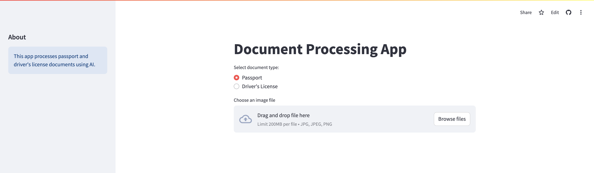
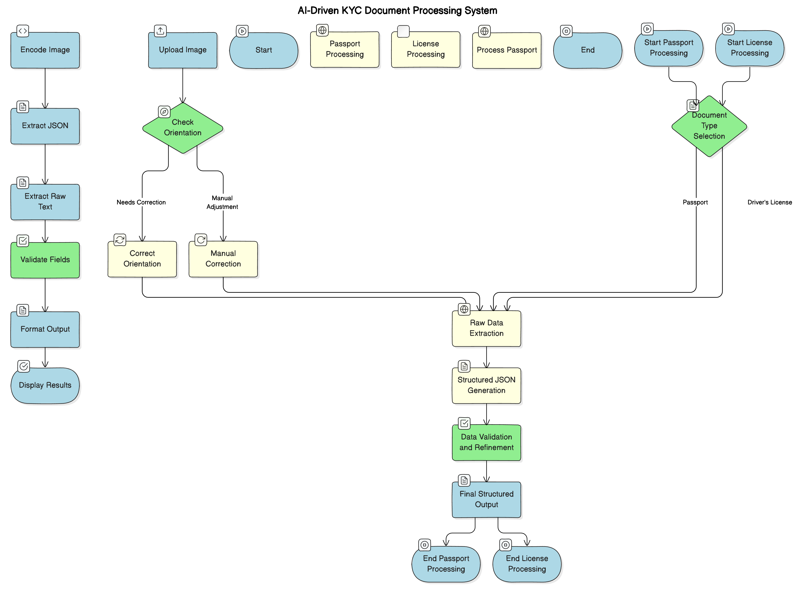
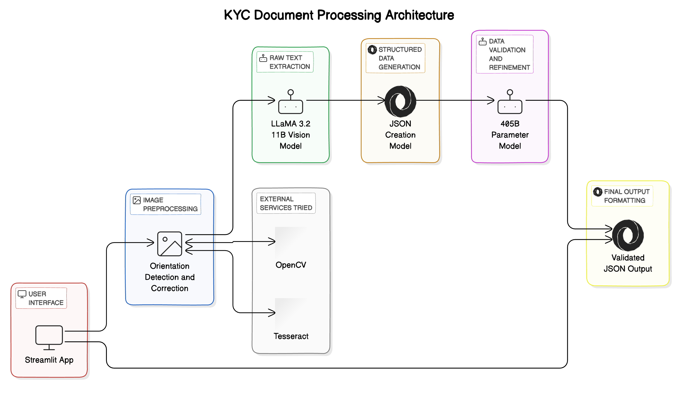

# AI-Driven KYC Document Processing System

[](https://projectassignmentfireworkai-zkorxhoprhrvfgnsiv4iu2.streamlit.app/)



This repository contains my implementation of an AI-driven system for processing Know Your Customer (KYC) documents. This project was part of an interview assignment provided by Fireworks AI. It is designed to automate the identity verification process for various document types, such as passports and driver's licenses, leveraging advanced AI techniques for information extraction, validation, and structuring.

## Live Demo

You can try out the live demo of this project here: [KYC Document Processing App](https://projectassignmentfireworkai-zkorxhoprhrvfgnsiv4iu2.streamlit.app/)

## System Architecture


Below, you will find a detailed description of the components, methodologies, and system architecture employed in this project.

## Table of Contents
1. [Overview](#overview)
2. [System Architecture](#system-architecture)
3. [Pipeline Components](#pipeline-components)
4. [Challenges and Solutions](#challenges-and-solutions)
5. [Future Directions](#future-directions)
6. [How to Run](#how-to-run)

## Overview
The goal of this project is to automate and enhance the KYC process using AI models, focusing on accuracy, efficiency, and adaptability across different document types. The system follows a multi-model pipeline approach to achieve high accuracy in extracting, validating, and structuring information from documents. Key features include:

- **Automatic image orientation correction** for improved model performance.
- **Multi-model pipeline** combining different large language models to enhance accuracy.
- **Manual correction fallback** to handle document cases where automated methods may fail.
- **Structured data output** using Pydantic models for consistent and validated results.

## System Architecture

Below is a textual representation of the system architecture that helps illustrate the data flow:

```
            +----------------------------+
            |       Start Process        |
            +------------+---------------+
                         |
                         v
            +----------------------------+
            |   1. Image Upload &        |
            |      Preprocessing         |
            +------------+---------------+
                         |
                         v
            +----------------------------+
            |   2. Document Type         |
            |      Selection             |
            +------------+---------------+
                         |
                         v
            +----------------------------+
            |   3. Image Orientation     |
            |      Correction            |
            +------------+---------------+
                         |
                         v
            +----------------------------+
            |   4. Data Extraction       |
            |      & Structuring         |
            +------------+---------------+
                         |
                         v
            +----------------------------+
            |   5. Data Validation &     |
            |      Final Output          |
            +----------------------------+
```

The AI-driven KYC document processing system architecture consists of the following main steps:

1. **Image Upload and Preprocessing**: Handles user-uploaded images, ensuring all image formats (JPEG, PNG, etc.) are supported.
2. **Document Type Selection**: Allows users to choose between processing a passport or a driver's license.
3. **Image Orientation Correction**: Uses a language model to determine the document orientation for improved accuracy.
4. **Data Extraction and Structuring**: Involves extracting raw text from the document, generating structured JSON, and validating the extracted data.
5. **Validation and Final Output**: Uses a larger language model for data validation and generates a structured output in JSON format, validated against Pydantic models.

For better understanding, please refer to the diagram below, which visually represents the system architecture and flow of the KYC document processing system.



## Pipeline Components

### 1. Initial Image Processing
- **Upload and Preprocess**: The system starts with uploading an image, converting it to the appropriate format, and checking for correct orientation.
- **Orientation Detection and Correction**: The `orientation.py` script uses the LLaMA model to determine the correct orientation and rotates accordingly. A fallback manual correction feature is also available.

### 2. Raw Data Extraction
- **Passport and License Processing**: The `passport_processing.py` and `license_processing.py` scripts handle data extraction from specific document types. The LLaMA 3.2 11B vision model is utilized to extract raw text data.

### 3. Structured JSON Generation
- After extracting raw text, the system employs a language model to convert this data into a structured JSON format, adhering to predefined Pydantic models.

### 4. Data Validation and Refinement
- **Validation Using LLaMA 405B Model**: To ensure data consistency and accuracy, the extracted data is validated by a LLaMA 405B model. This stage involves reconciling discrepancies and refining the structured JSON output.

### 5. User Interface and Manual Adjustment
- **Streamlit App**: The `app.py` script implements the user interface where users can upload documents, manually adjust the orientation if needed, and view the results.
- **Manual Orientation Adjustment**: Users can manually adjust the document's rotation using a slider feature if the automatic orientation detection doesn't yield the correct result.

## Challenges and Solutions

### 1. Image Orientation
- **Challenge**: Incorrect orientation led to degraded model performance.
- **Solution**: Implemented a custom orientation detection system using a LLaMA model, with a manual correction option for further adjustment.

### 2. Data Consistency
- **Challenge**: Inconsistencies between raw data extraction and structured JSON generation.
- **Solution**: Implemented a data validation step using a LLaMA 405B model and Pydantic models to ensure consistency and accuracy.

### 3. Single Model Limitations
- **Challenge**: Single-model approaches did not achieve the desired accuracy.
- **Solution**: Developed a multi-model pipeline that combined different models for better accuracy and robustness.

### 4. MRZ Extraction Accuracy
- **Challenge**: Initial attempts at extracting Machine Readable Zone (MRZ) data were inaccurate.
- **Solution**: Refined the extraction process to capture raw MRZ data and implemented post-processing to ensure correct formatting.

## Future Directions

1. **Model Fine-Tuning**: Fine-tune the LLaMA vision model on a diverse set of KYC documents for improved performance.
2. **Expanded Document Support**: Extend the system to handle a wider variety of documents, such as national ID cards and utility bills.
3. **Real-Time Integration**: Implement API connections to external services for cross-referencing extracted data and real-time validation.
4. **Enhanced UI/UX**: Improve user feedback mechanisms, batch processing capabilities, and enhanced error handling.
5. **Optimized Processing Pipeline**: Further refine the multi-step process to reduce API calls and improve efficiency.

## How to Run

### Prerequisites
- Python 3.8 or later
- Dependencies as specified in `requirements.txt`
- API access to Fireworks AI

### Steps to Run
1. **Clone the Repository**:
   ```sh
   git clone https://github.com/Ali-Maq/Project_Assignment_Fireworkai
   cd kyc-document-processing
   ```
2. **Install Dependencies**:
   ```sh
   pip install -r requirements.txt
   ```
3. **Set up Environment Variables**:
   Create a `.env` file in the root directory and add your Fireworks AI API key:
   ```
   FIREWORKS_API_KEY=your_api_key_here
   ```
4. **Run the Streamlit App**:
   ```sh
   streamlit run app.py
   ```
5. **Upload a Document**: Once the app is running, upload a passport or driver's license for processing.
6. **View Results**: The app will display the extracted and validated data in JSON format.

### Deploying the Streamlit App
To deploy this Streamlit app, you can use **Streamlit Cloud** or any other cloud service that supports Python applications. Follow the Streamlit Cloud deployment guidelines, ensuring that you set up the necessary environment variables for API access.

